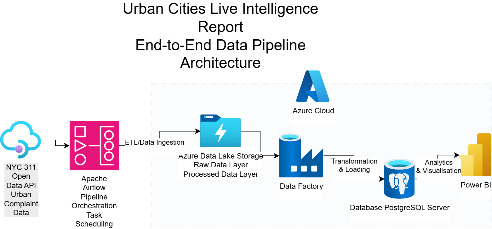
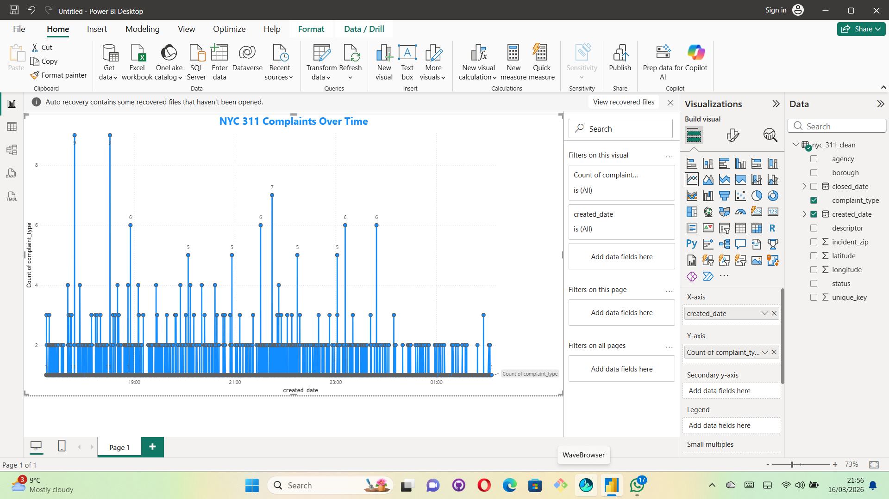
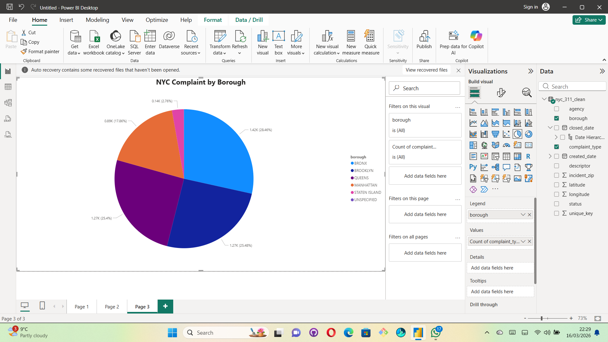
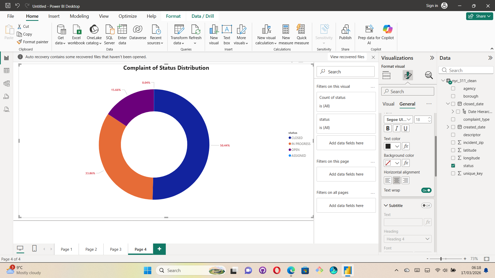
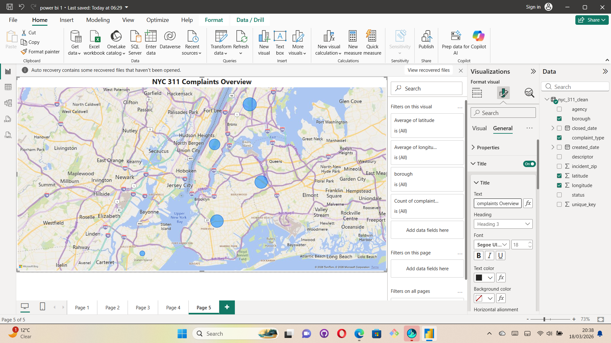
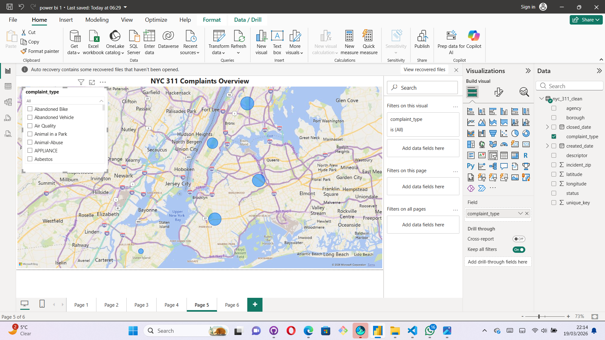
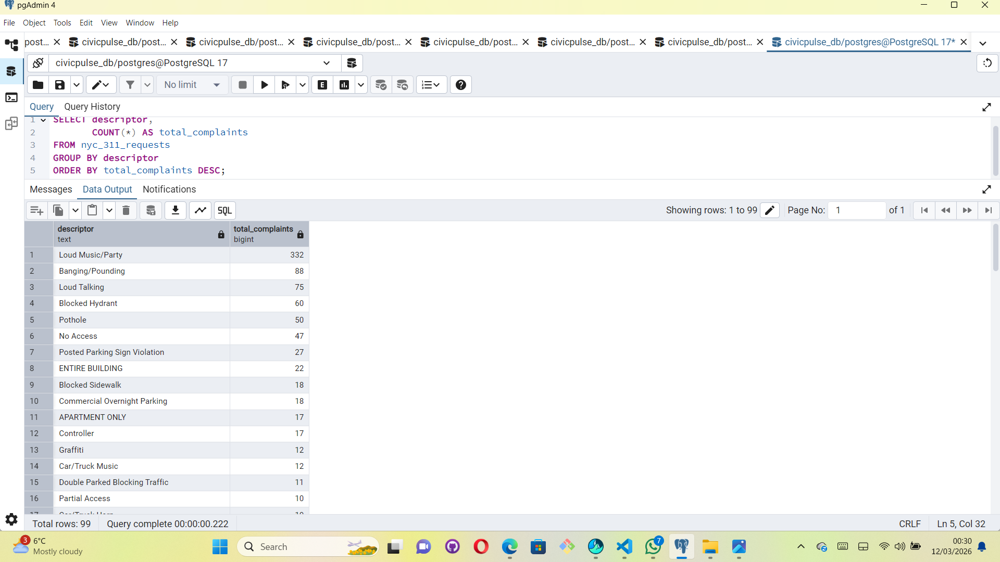
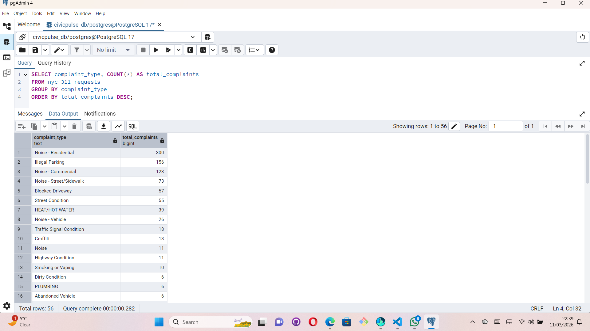

## Urban Service Analytics Platform

## Overview

Urban Service Analytics is an end-to-end data engineering and analytics project designed to ingest, process, store, and visualize urban service complaint data (NYC 311).

This project demonstrates a complete modern data pipeline:
	•	Data ingestion from API(NYC 311 Dataset)
	•	Data transformation and cleaning
	•	Storage in both data lake and database
	•	Workflow orchestration using Apache Airflow
	•	Infrastructure provisioning using Terraform (Azure)
	•	Business intelligence reporting using Power BI
	
## Business Objective

The objective of this project is to build an end-to-end data platform that transforms raw urban service complaint data into actionable insights for decision-making.

Specifically, the solution aims to:
	•	Monitor and analyze patterns in citizen-reported issues (NYC 311 complaints)
	•	Identify high-demand service areas across boroughs
	•	Improve operational efficiency by highlighting frequently reported complaint types
	•	Enable data-driven decision-making through interactive dashboards
	•	Provide real-time or near-real-time visibility into urban service performance

   ## Architecture

 

## Power BI


















[

[


## 📁 Project Structure

```bash
URBAN-SERVICE-ANALYTICS/
├── airflow/
│   └── civicpulse_pipeline.py
├── data/
│   ├── raw/
│   │   └── nyc_311_raw.csv
│   └── processed/
│       └── nyc_311_clean.csv
├── docs/
│   └── architecture/
│       └── urban_data_pipeline_architecture.png
├── src/
│   ├── ingest_api.py
│   ├── transform_data.py
│   ├── clean_data.py
│   ├── load_to_data_lake.py
│   └── load_to_db.py
├── terraform/
│   ├── main.tf
│   ├── provider.tf
│   ├── variables.tf
│   └── output.tf
├── requirements.txt
├── README.md
└── .gitignore

	•	Python – ETL pipeline development
	•	Apache Airflow – Workflow orchestration
	•	PostgreSQL – Structured data storage
	•	Terraform (AzureRM) – Infrastructure as Code
	•	Power BI – Data visualization & reporting
	•	REST API – Data ingestion

 ##   Data Pipeline (End-to-End)

    Data Ingestion (ingest_api.py)
	•	Connects to NYC 311 API
	•	Retrieves raw JSON data
	•	Converts to structured format (CSV)

##    Data Transformation (transform_data.py, Clean_data.py)
	•	Handles missing values
	•	Standardizes formats
	•	Selects relevant columns:
	•	complaint_type
	•	borough
	•	status
	•	created_date
	•	latitude & longitude 

  ##  Data Storage

📁 Data Lake (load_to_data_lake.py)
Stores cleaned data in:
data/processed/nyc_311_clean.csv

Database (load_to_db.py)
	•	Loads structured data into PostgreSQL
	•	Supports querying for analytics


## Workflow Orchestration (Airflow)

DAG: civicpulse_pipeline.py
Pipeline stages:
	1.	Extract → API ingestion
	2.	Transform → Data cleaning
	3.	Load → Data lake + Database
Features:
	•	Scheduled execution
	•	Retry mechanism
	•	Logging and monitoring


    Infrastructure as Code (Terraform - Azure)
Terraform automates:
	•	Cloud resource provisioning
	•	Database setup
	•	Environment configuration

Key Files:
	•	main.tf → Core resources:Complaint volume varies significantly across boroughs
	•	provider.tf → Azure configuration:A small number of complaint types dominate total volume
	•	variables.tf → Parameterization:Trends reveal temporal spikes in service demand
	•	output.tf → Outputs:Geographic clustering highlights service pressure areas

## Power BI Dashboard

The final layer delivers insights through an interactive dashboard.

Key Features:


## Key Insights
	•	Complaint volume varies significantly across boroughs
	•	A few complaint types dominate overall volume
	•	Temporal trends reveal spikes in service demand
	•	Geographic clustering highlights urban service pressure areas

    How to Run this Project
    1. Install dependencies
    pip install -r requirements.txt

    2. Run ETL manually
    python src/ingest_api.py
    python src/transform_data.py
    python src/load_to_data_lake.py
    python src/load_to_db.py

    3. Run Airflow
    airflow scheduler
    airflow webserver

    4. Deploy Infrastructure (Terraform)
    cd terraform
    terraform init
    terraform apply

    5. Open Power BI
	•	Load .pbix file
	•	Connect to database or CSV
	•	Explore 


    Future Improvements
	•	Real-time streaming pipeline (Kafka / Spark)
	•	Cloud data warehouse (Snowflake / BigQuery)
	•	CI/CD pipeline for automation
	•	Advanced analytics & ML integration
	•	Dashboard auto-refresh

    Author
Kwabena Agyei Asamoah
📍 Birmingham, UK
